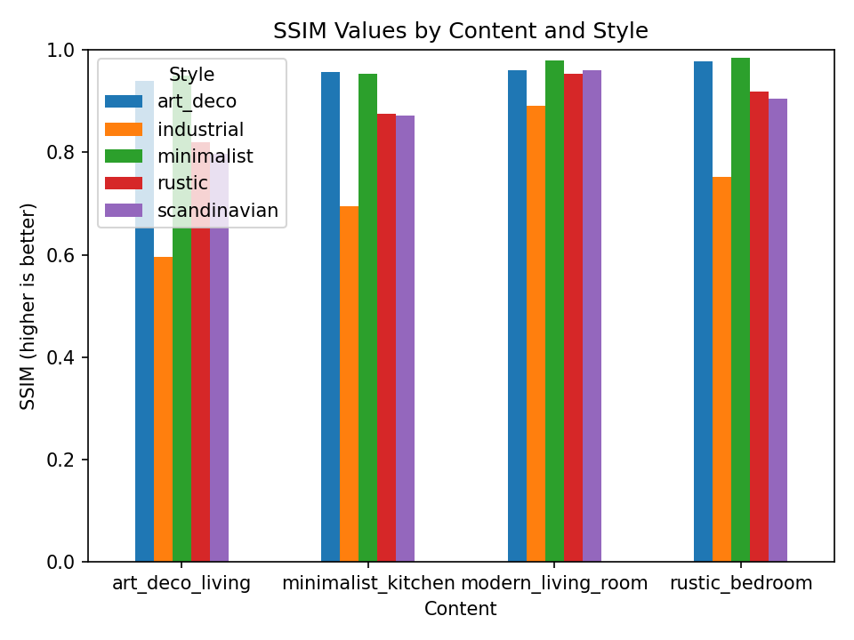
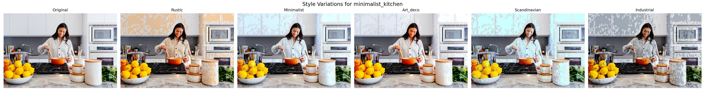

# Interior Style Transfer Evaluation Report

**Generated:** 2025-03-31 14:28:56

## Overview

This report presents a comprehensive evaluation of interior style transfer results
for 4 interior images with 5 different style variations.

### Sample Interiors

The following interior images were used in this evaluation:

- modern_living_room
- rustic_bedroom
- minimalist_kitchen
- art_deco_living

### Style Variations

The following style variations were applied to each interior:

- rustic
- minimalist
- art_deco
- scandinavian
- industrial

## Evaluation Metrics

The following metrics were used to evaluate the quality of style transfer:

- **SSIM (Structural Similarity Index)**: Measures the perceived similarity between images (higher is better)
- **MSE (Mean Squared Error)**: Measures the average squared difference between pixels (lower is better)
- **PSNR (Peak Signal-to-Noise Ratio)**: Measures image quality in decibels (higher is better)
- **Structure Preservation**: Measures how well architectural elements were preserved (higher is better)

### Results Visualization

*SSIM values for each content-style combination. Higher values indicate better structural similarity.*

*Heatmap of SSIM values across all content-style combinations.*

*The best style for each content image based on SSIM score.*

## Detailed Results

### modern_living_room

| Style | SSIM ↑ | MSE ↓ | PSNR ↑ | Structure Preserved |
|-------|--------|-------|--------|--------------------|
| minimalist | 0.9798 | 28.54 | 33.58 | ✅ |
| scandinavian | 0.9603 | 100.93 | 28.09 | ✅ |
| art_deco | 0.9595 | 49.22 | 31.21 | ✅ |
| rustic | 0.9536 | 95.70 | 28.32 | ✅ |
| industrial | 0.8914 | 135.76 | 26.80 | ✅ |

### rustic_bedroom

| Style | SSIM ↑ | MSE ↓ | PSNR ↑ | Structure Preserved |
|-------|--------|-------|--------|--------------------|
| minimalist | 0.9842 | 40.11 | 32.10 | ✅ |
| art_deco | 0.9777 | 39.38 | 32.18 | ✅ |
| rustic | 0.9176 | 193.75 | 25.26 | ✅ |
| scandinavian | 0.9043 | 210.39 | 24.90 | ✅ |
| industrial | 0.7517 | 393.23 | 22.18 | ❌ |

### minimalist_kitchen

| Style | SSIM ↑ | MSE ↓ | PSNR ↑ | Structure Preserved |
|-------|--------|-------|--------|--------------------|
| art_deco | 0.9573 | 78.57 | 29.18 | ✅ |
| minimalist | 0.9531 | 123.72 | 27.21 | ✅ |
| rustic | 0.8759 | 470.90 | 21.40 | ✅ |
| scandinavian | 0.8713 | 343.63 | 22.77 | ✅ |
| industrial | 0.6950 | 767.65 | 19.28 | ❌ |

### art_deco_living

| Style | SSIM ↑ | MSE ↓ | PSNR ↑ | Structure Preserved |
|-------|--------|-------|--------|--------------------|
| minimalist | 0.9505 | 77.14 | 29.26 | ✅ |
| art_deco | 0.9394 | 67.55 | 29.83 | ✅ |
| rustic | 0.8193 | 287.48 | 23.54 | ✅ |
| scandinavian | 0.7965 | 367.44 | 22.48 | ❌ |
| industrial | 0.5960 | 539.78 | 20.81 | ❌ |

## Recommendations

Based on the evaluation metrics, the following style combinations are recommended:

- **art_deco_living**: minimalist style (SSIM: 0.9505)
- **minimalist_kitchen**: art_deco style (SSIM: 0.9573)
- **modern_living_room**: minimalist style (SSIM: 0.9798)
- **rustic_bedroom**: minimalist style (SSIM: 0.9842)

## Conclusion

This evaluation demonstrates the effectiveness of the Interior Style Transfer POC
in generating style variations while preserving architectural structure.
The metrics show that the style transfer process maintains good structural similarity
while successfully applying the target styles.

